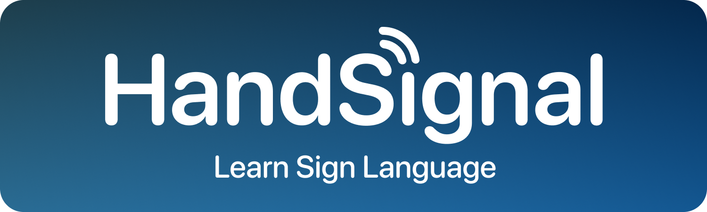
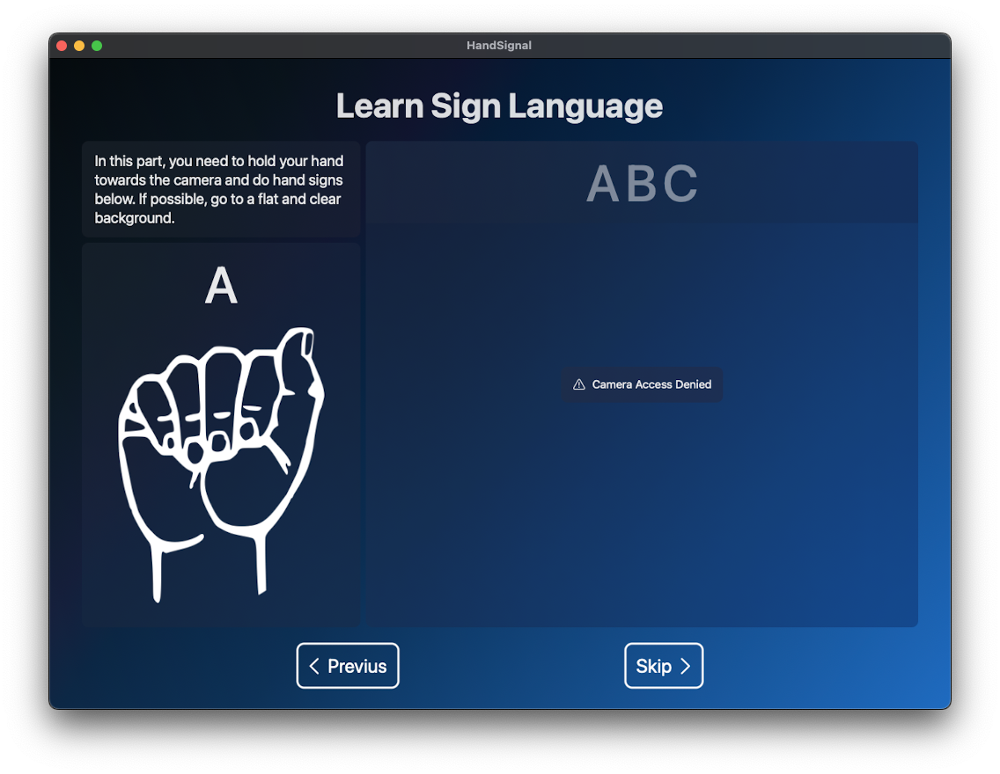
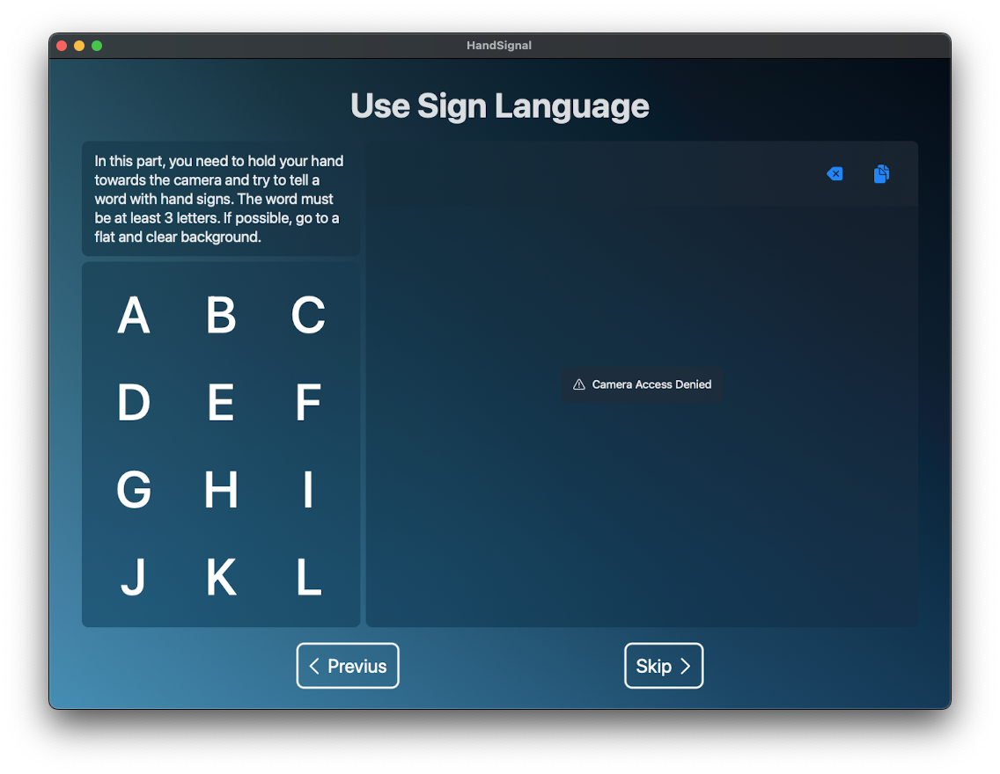

#  HandSignal
### Apple Swift Student Challenge 2023 Project **(Accepted)**

HandSignal is made for informing people about sign language. With this project, you can learn base information about sign language and some basic hand signs, with visual instructions and live-action exercises.

**Used Technologies**: SwiftUI, Concurrency, CoreML

|  |  |
--- | ---

## Installation and Usage

### Requirements

Supported Devices: 
  - iPad Pro 11-inch or 12.9-inch
  - A Mac with a camera

Supported Platforms: 
  - iPadOS 16 or later
  - macOS 13 Ventura or later
    
### Installation

#### For macOS-only

- Download `HandSignal.app.zip` from the latest release at the Releases tab.
- Unzip the `HandSignal.app.zip` file.
- Run `HandSignal.app`.

#### For iPadOS and macOS

Requirements: Swift Playgrounds 4.2.1, Xcode 14 or later

- Clone the repository.
- Open the `HandSignal.swiftpm` file with Swift Playgrounds or Xcode.
- **(Xcode only)** Change the Run Destination to your device.
- Run the project.

### Usage

- Follow the steps in the app.

## Credits

- The "ASL" Spell Image
    - Source: [Wikimedia Commons](https://commons.wikimedia.org/wiki/File:American_Sign_Language_ASL.svg)
    - Author: Psiĥedelisto
    - License: [Public Domain (CC0)](https://creativecommons.org/publicdomain/zero/1.0/)
    
- Hand Sign of Letters in American Sign Language Images (from A to Z)
    - Source: [WPClipart](https://www.wpclipart.com/sign_language/American_ABCs/index.html)
    - License: [Public Domain (CC0)](https://creativecommons.org/publicdomain/zero/1.0/)
    
- American Sign Language Image Dataset
    - Source: [Roboflow](https://public.roboflow.ai/object-detection/american-sign-language-letters)
    - Author: David Lee
    - License: [Public Domain (CC0)](https://creativecommons.org/publicdomain/zero/1.0/)

## License

MIT License | Copyright (c) 2023 Alperen Örence

See [LICENSE.md](LICENSE.md).
